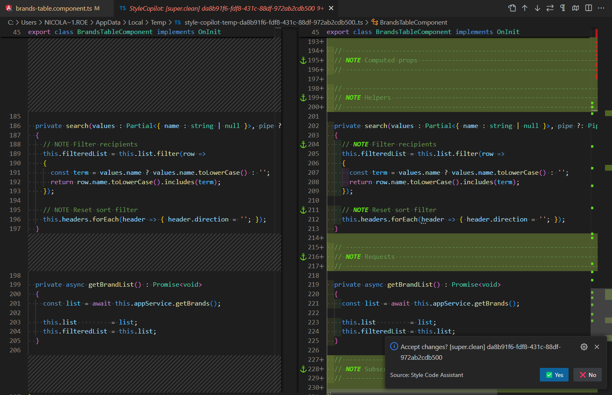
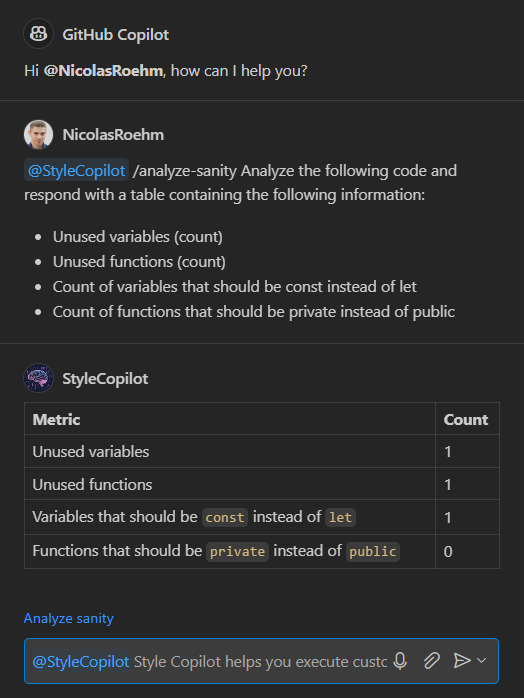

# Style Copilot [GitHub Copilot Extension]

The Style Copilot is a powerful GitHub Copilot Extension for creating snippets that can be triggered on files to execute predefined messages, based on your VSCode preferences.

<p align="center"></a></p>

## VSCode commands
**F1 > StyleCopilot: Execute custom command > [command.id]**

With Style Copilot, you can execute your own VSCode command that will modify the active file and provide a diff view, allowing you to review, ✅ accept or ❌ discard the changes.

To create a VSCode command, navigate to Preferences > Settings and provide it in JSON format, for example:

```json
"style-copilot.ai.customCommands": [
  {
    "id": "comment.block",
    "description": "Add comment blocks into component.ts",
    "prompt": "Add the following comment blocks at the root of the class and keep them in the exact same order : 'Init', 'Actions', 'Computed props', 'Helpers', 'Requests', 'Subscriptions'.\n Analyze the source code and move the functions under the dedicated comment block.\n Comment block template :\n // -------------------------------------------------------------------------------\n // NOTE BlockName ----------------------------------------------------------------\n // -------------------------------------------------------------------------------\n IMPORTANT respond just with code. Do not use markdown!",
  }
],
```

<p align="center"></p>

<p align="center" style="font-style:italic">A loading indicator is displayed at the bottom of the IDE during the generation of the response.</p>



## Chat actions

**Chat > @StyleCopilot > /action-id**

During your conversation with the GitHub Copilot AI, you can enable this assistant by mentioning [@StyleCopilot](#) and including or clicking on the previously defined [/action-id](#) in your VSCode settings, to quickly send a message!

Here is a JSON example to add an action to your Chat in your Preferences > Settings:

```json
"style-copilot.ai.customActions": [
  {
    "id": "analyze-sanity",
    "description": "Analyze the sanity of a component.ts",
    "label": "Analyze code sanity",
    "loadingLabel": "Analyzing...",
    "prompt": "Analyze the following code and respond with a table containing the following information:\n- Unused variables (count)\n- Unused functions (count)\n- Count of variables that should be const instead of let\n- Count of functions that should be private instead of public"
  }
],
```

<p align="center"></a></p>

## Project settings

Style Copilot is using the gpt-4o Language Model, as you can see in [model.const.ts](./consts/model.const.ts).

## Credits

* VSCode extension samples - [microsoft/vscode-extension-samples/chat-sample](https://github.com/microsoft/vscode-extension-samples/tree/main/chat-sample)
